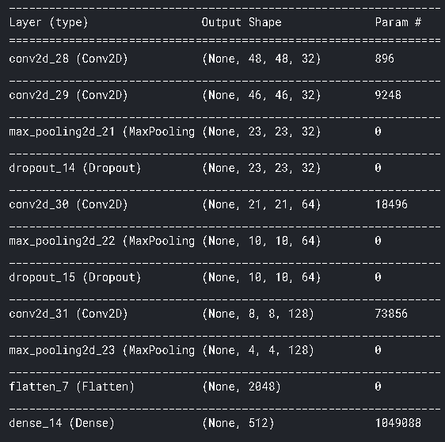
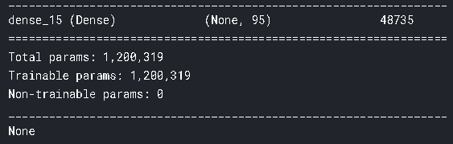
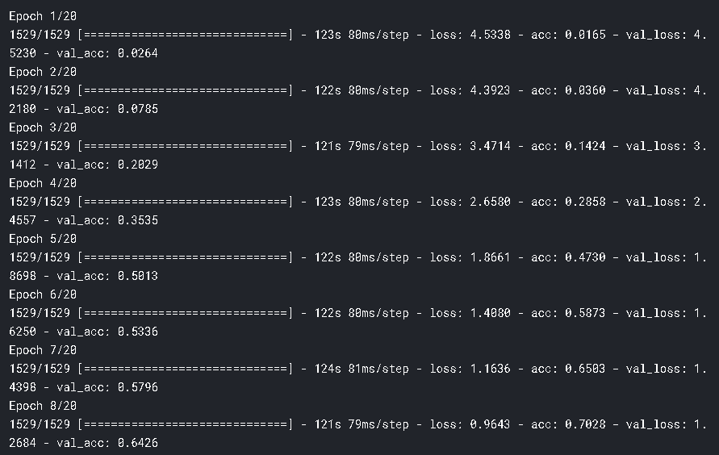
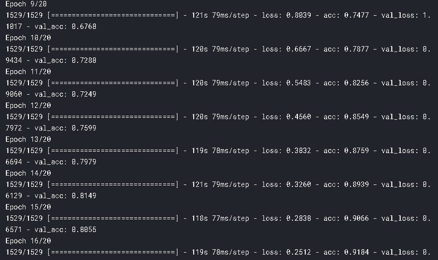
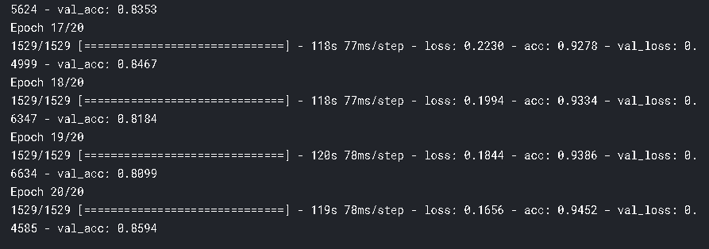
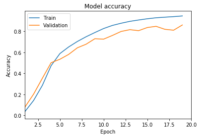

# fruits_classification

This classifies fruits of 95 classes with the help of image classification deep learning CNN method using keras and tensorflow as backend.

## usage 
```
python3 fruits360.py 
```
NOTE :
Edit the training and validation dataset path from the code.

## Dataset
You can find the dataset from [here](https://www.kaggle.com/moltean/fruits).

## CNN layers 




## Epoch





## Accuracy and loss


